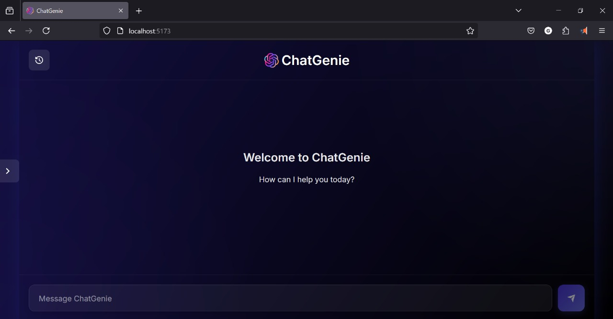

# ChatGenie - AI Chat Interface

A modern and interactive chat application integrating a Python-based backend with a React-based frontend, providing a seamless chatting experience. The project ensures a clear separation of backend and frontend components while leveraging modern development tools like Flask, Vite, and ESLint for a robust and maintainable codebase. ChatGenie offers an elegant AI chat interface with a beautiful dark theme and glass-morphism design.



## Features

- **Beautiful Dark Theme** - Sleek dark mode with glass-morphism effects
- **Real-time AI Chat** - Smooth conversational experience
- **Code Highlighting** - Syntax highlighting for 20+ programming languages
- **Math Support** - Renders mathematical equations using KaTeX
- **Desktop-Optimized** - Best experience on desktop devices
- **Chat History** - Preserves conversations with local storage
- **Markdown Support** - Rich text formatting with tables, lists, and more

## Project Structure

### Root Directory: `CHATGENIE`
- **backend/**: Server-side logic
  - `env/`: Virtual environment for Python dependencies
  - `app.py`: Main Flask application entry point
  - `chat.py`: Manages chat operations and AI responses
  - `config.py`: Configuration settings
  - `errors.py`: Error handling logic
  - `formatting.py`: Utilities for formatting responses
  - `requirements.txt`: Python dependencies
  - `validation.py`: Input validation logic
  - `tests/`
    - `test_chat.py`: Unit tests for chat functionality
  - `chatgenie.log`: Log file for application events

- **frontend/**: Client-side React application
  - `node_modules/`: Node.js dependencies
  - `public/`: Static assets
    - `ChatGenie-logo.png`: Project logo
  - `src/`: React source code
    - `components/`: Reusable React components
      - `Chat.jsx`, `ChatHeader.jsx`, `Sidebar.jsx`, etc.
    - `styles/`: CSS files
    - `utils/`: JavaScript utility functions
    - `App.jsx`: Main React component
    - `main.jsx`: React entry point
  - `.eslintrc.config.js`: ESLint configuration
  - `vite.config.js`: Vite build configuration

- **Root Files**:
  - `README.md`: Project documentation
  - `.gitignore`: Files and directories to exclude from Git
  - `images/`: Additional image assets

---

## Setup Instructions

### Clone the Repository
```bash
git clone https://github.com/your-username/ChatGenie.git
cd ChatGenie
```

### Backend Setup
```bash
cd backend
python -m venv env
source env/bin/activate  # On Windows: env\Scripts\activate
pip install -r requirements.txt
```

### Frontend Setup
```bash
cd frontend
npm install
```

### Running the Application

**Start the Backend Server**:
```bash
cd backend
python app.py
```
- The Flask server runs on `http://localhost:5000`

**Start the Frontend Server**:
```bash
cd frontend
npm run dev
```
- Access the app at `http://localhost:5173`

---

## Known Issues & Troubleshooting

### TypeScript File Name Conflicts
- **Issue**: "Already included file name... differs from file name..."
- **Fix**: Ensure consistent file name casing (e.g., `Sidebar.jsx` vs `sidebar.jsx`).

### Import Resolution Error
- **Issue**: "Failed to resolve import './components/Sidebar.jsx'"
- **Fix**: Verify correct file paths and adjust imports accordingly.

### HMR Overlay Issues
- **Issue**: Error overlay appears during development
- **Fix**: Dismiss manually or disable in `vite.config.js`:
  ```js
  server: { hmr: { overlay: false } }
  ```

---

## Contributing

1. Fork the repository
2. Create a feature branch (`git checkout -b feature/your-feature`)
3. Commit your changes (`git commit -m "Add your feature"`)
4. Push to your branch (`git push origin feature/your-feature`)
5. Submit a pull request

Ensure your code follows ESLint rules and includes necessary tests.

---

## License

This project is licensed under the MIT License. See the `LICENSE` file for details.
